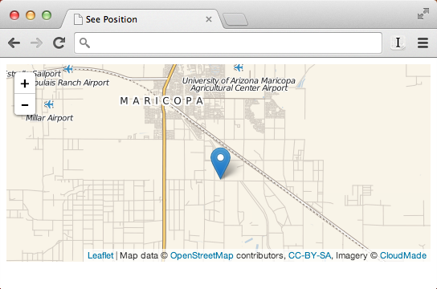

Realtime GPS Map Plotting
=========================

Impress your friends! See your real time location via your mobile device and HTML5

A realtime GPS tracker using:

 * [Socket.io](socket.io)
 * NodeJS
 * [CompassJS](http://www.rickcarlino.com/simplifying-access-to-the-html5-geolocation-api/)
 * [LeafletJS](leafletjs.com)
 * [Cloudmade Maps](http://www.cloudmade.com)

A fun project I completed in one afternoon and < 100 lines of code. Maybe someone
will find a use for this. Maybe.

Running it on your machine
--------------------------

 1. Replace the following text in the project:
      `CLOUDMADE_API_KEY_HERE` - You will need to get a cloudmade API key
      `CLOUDMADE_TOKEN_HERE` - See above.
      `SERVER_URL_HERE` - The URL of the backend server (that will run `index.js`)
 2. Run `npm install` and then `node index.js`
 3. Visit `send.html` with your mobile device to transmit your location.
 4. Visit `see.html` to view the user's location on a live map.